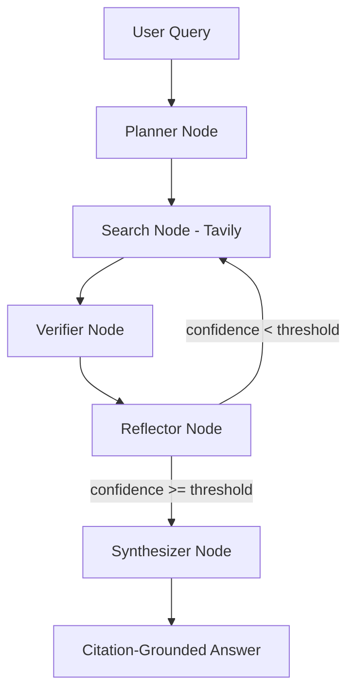

# ResearchFlow AI ??
### Self-Correcting Agentic Research Pipeline · LangGraph + FastAPI + AWS Bedrock

[](https://python.org)
[](https://github.com/langchain-ai/langgraph)
[](https://fastapi.tiangolo.com)
[](https://aws.amazon.com/bedrock/)
[](https://tavily.com)
[](LICENSE)

> **ResearchFlow AI** is a production-grade agentic research system that decomposes complex questions into sub-queries, retrieves and verifies web evidence, and synthesizes citation-grounded answers — with self-correcting retry logic when evidence quality is low.

---

## ? Features Update

The application has been extensively refactored to support a **monolithic architecture** with a brand new UI:
- **Modern Chat Interface:** Real-time streaming output, markdown formatting, and inline citation badges.
- **Execution Tracing:** Live accordion tracing the agent's thought process (planning, searching, verifying, synthesizing) step-by-step.
- **Dark Mode Support:** Fully integrated dark mode with local-storage preference saving.
- **Single Backend:** Unified FastAPI server natively rendering HTML templating and providing the API streaming endpoints — removing the need for a separate Node.js/React frontend.
- **AWS Bedrock Backend:** Swapped from local Ollama to highly-capable AWS Bedrock cloud models (e.g. `amazon.nova-pro-v1:0`).

---

## ??? Architecture



### Node Responsibilities

| Node | Role |
|------|------|
| **Planner** | Analyzes query intent, defines research strategy and sub-questions |
| **Search** | Retrieves web evidence via Tavily Search API |
| **Verifier** | Scores evidence relevance and confidence (0–100%) |
| **Reflector** | Identifies gaps in information and handles retry conditions |
| **Synthesizer** | Generates detailed comprehensive answers with inline citations (`[1]`, `[2]`) |

---

## ?? Quick Start

### Prerequisites
- Python 3.10+
- AWS Account with Bedrock capabilities & Credentials configured.
- Tavily API key (free tier at [tavily.com](https://tavily.com))

### Installation

```bash
git clone https://github.com/krishnakoushik225/langgraph-research-agent
cd langgraph-research-agent
python -m venv .venv
source .venv/bin/activate   # Windows: .venv\Scripts\activate

# Install dependencies (from pyproject.toml or requirements.txt)
pip install -e .
# OR pip install fastapi uvicorn langgraph langchain boto3 tavily-python python-dotenv jinja2
```

### Environment Setup

Create a `.env` file in the root directory:
```bash
TAVILY_API_KEY=your_tavily_key
AWS_ACCESS_KEY_ID=your_aws_key
AWS_SECRET_ACCESS_KEY=your_aws_secret
AWS_REGION=us-east-1
BEDROCK_MODEL=amazon.nova-pro-v1:0
```

### Run

```bash
uvicorn src.main:app --reload
```
Navigate to `http://127.0.0.1:8000` to interact with the modern web UI.

---

## ??? Tech Stack

| Layer | Technology |
|-------|-----------|
| Agent Orchestration | LangGraph (cyclic state machine) |
| LLM Backend | AWS Bedrock |
| Web Search | Tavily Search API |
| Web Server | FastAPI (async + Server-Sent Events stream) |
| Frontend | HTML5 + Tailwind CSS + Vanilla JS + FontAwesome |

---

## ?? Project Structure

```
ganusa-research-agent/
+-- src/
¦   +-- graph/
¦   ¦   +-- nodes/
¦   ¦   ¦   +-- planner.py        # Generates research strategy
¦   ¦   ¦   +-- search.py         # Handles Tavily integration
¦   ¦   ¦   +-- verifier.py       # Confidence checking
¦   ¦   ¦   +-- reflector.py      # Reflection and cyclic routing
¦   ¦   ¦   +-- synthesizer.py    # Answer drafting
¦   ¦   +-- builder.py            # LangGraph assembly
¦   ¦   +-- state.py              # TypedDict shared state
¦   +-- schemas/
¦   ¦   +-- api.py                # Pydantic models
¦   +-- services/
¦   ¦   +-- bedrock_client.py     # AWS Bedrock API interface
¦   ¦   +-- tavily_client.py      # Search interactions
¦   +-- static/
¦   ¦   +-- css/style.css         # Tailwind/custom styles
¦   ¦   +-- js/main.js            # Chat UI logic, SSE parsing
¦   +-- templates/
¦   ¦   +-- index.html            # Main Chat Interface (Jinja2)
¦   +-- config.py                 # Env loader
¦   +-- main.py                   # FastAPI Routing and WebApp Entry
+-- pyproject.toml
+-- Makefile
+-- README.md
```

---

## ?? License

MIT — free to use and build on.

---
